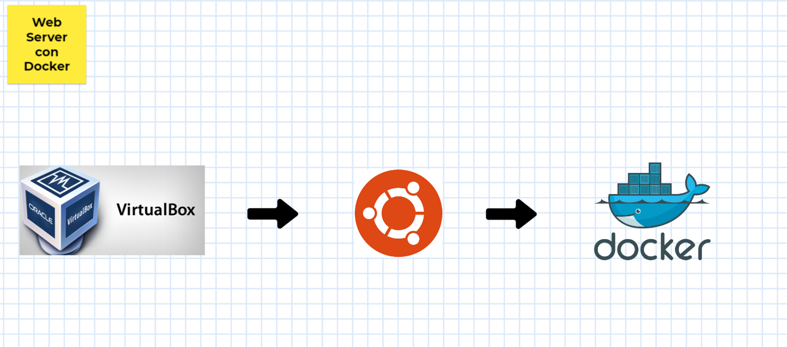

# Reto Docker

**Como prerequisitos es necesario tener lo siguiente:**

* Máquina Virtual hecha con Virtual Box (opcional)
* Tener Ubuntu o Ubuntu Server Instalado
* Tener Docker instalado en ubuntu
* Tener dado de alta nuestro usuario en el grupo de docker

>Si eres nuevo puedes encontrar como instalar y configurar los pre requisitos aquí:
> * [Crear máquina virtual con Linux](https://www.facebook.com/ITLEARNINGMEX/videos/292578068548548/)
> * [Como instalar Docker](https://www.facebook.com/ITLEARNINGMEX/videos/258659821882769/)

### Instalando Nginx web server

De forma introductoria, Nginx es un web server similar a Apache, sin embargo éste está diseñado pensando en el alto rendimiento y en la simlpeza a la hora de usarlo.

Se escogió este servidor debido a lo ligero y rápido, así como lo popular que se ha vuelto en herramientas DevOps últimamente.

> Puedes visitar https://hub.docker.com/ y buscar la imagen de docker Nginx 
> ahí encontraras ejemplos de valor para orientarte como empezar.

### Crea una carpeta donde almacenarás los archivos del web server
Esto lo puedes hacer mediante el protocolo SMB en Linux, ayudará mucho a la hora de estar subiendo archivos a nuestro web server para no tener que hacerlo desde la máquina virtual sino desde cualquier dispositivo de nuestra red local.

### Validando nuestra instalación de Nginx

A continuación procederemos a crear un archivo HTML de ejemplo y lo accederemos desde nuestro servidor.
Muévete de directorio hacia la carpeta que creaste para alojar los archivos que el web server mostrará.
Crea el archivo index.html y procede a poner un texto de prueba

Finalmente para probar que nuestro servidor muestra la página web que acabamos de crear haremos lo siguiente:
* Verifica que el browser muestre el texto que agregaste en el archivo HTML.
* Accede a la IP de tu Ubuntu server a través del browser y el puerto que especificaste durante la ejecución del comando Docker run

### Facilitando el subir archivos 
Para hacer mucho más sencillo el trabajo de estar subiendo archivos a nuestro servidor web desde nuestra computadora haz una carpeta compartida en nuestro servidor Ubuntu.
Para ello usa el protocolo SMB que es el que por defecto utiliza Windows y el software Samba en Linux.

* Inicia instalando Samba.
* Y agrega como carpeta compartida la carpeta que seleccionamos para guardar nuestros documentos web
* Dá permisos al usuario para acceder a la carpeta

### Validando que ahora podemos subir archivos a nuestro web server por medio de Samba.

* Accede a la IP de tu Ubuntu mediante **red**, debes de ver una carpeta con el nombre que le diste a tu carpeta compartida en Samba
* Abre la carpeta, se te pedirá, usuario y contraseña. Usa el usuario de tu máquina Ubuntu y la contraseña que generaste para el usuario Samba.
* Una vez puedas abrir la carpeta, sólo hace falta agregar los archivos que quieras subir a tu web server. Por ejemplo sube o crea un hola.html que contenga el mensaje **"Hola, desde Ngxin"**
* Y por último comprueba que este archivo es accesible desde tu web server abriendo el web browser en tu máquina local (la que tiene instalado Virtual Box) y poniendo en tu barra de direcciones **http://webserver-ip:puerto/hola.html** reemplaza la IP por la IP que obtuviste en los primeros pasos.
* El mensaje **"Hola, desde Ngxin"** debe de ser desplegado en tu navegador.

### Comenta en Nuestras redes sociales https://www.facebook.com/ITLEARNINGMEX/posts/2862087017222647
* Si tienes dudas
* Aclaraciones
* **Comparte la evidencia de que lo lograste con screenshoots de tu web server funcionando**

